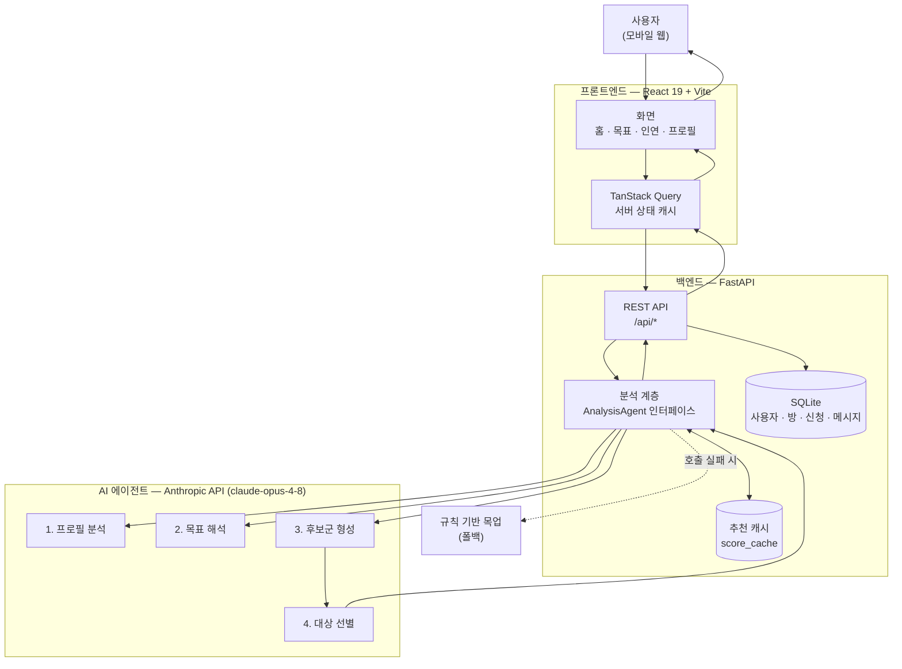
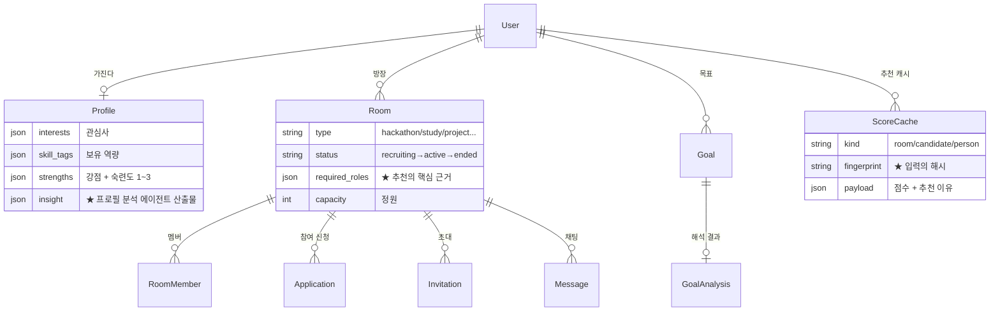

# 연(緣) — 최종 산출물

2026 SW 디지털 경진대회 제출 문서

---

## 1. 최종 산출물 개요

### 목적

**연(緣)** 은 함께할 사람을 찾는 모바일 웹 서비스다. 공모전·해커톤·스터디·사이드 프로젝트처럼
**혼자서는 할 수 없는 일**을 목표로 삼은 사람들이 서로를 발견하도록 돕는다.

### 해결하려는 문제

공모전에 나가고 싶은 프론트엔드 개발자가 있다. 백엔드와 디자이너가 필요하다. 그런데:

| 기존 방식 | 무엇이 문제인가 |
| --- | --- |
| 오픈 채팅방·커뮤니티 게시글 | "백엔드 구합니다" 글이 흘러간다. 누가 나와 맞는지는 알 수 없다 |
| 지인 소개 | 아는 사람의 범위를 벗어나지 못한다 |
| 기존 매칭 서비스 | 태그가 **같은** 사람을 추천한다. 팀에 필요한 건 나와 **다른** 사람이다 |

핵심은 **유사성이 아니라 상호보완성**이다. React를 잘하는 사람에게 React를 잘하는 사람을
붙여주는 것은 팀 구성에 도움이 되지 않는다. 필요한 것은 내가 갖지 못한 역량을 가진 사람이다.

이 판단은 태그 일치 계산으로는 되지 않는다. "FastAPI·PostgreSQL·AWS"라는 문자열과
"AI 해커톤에 나갈 백엔드가 필요해요"라는 문장 사이의 거리를 이해해야 한다.
**그래서 AI 에이전트를 썼다.**

### 핵심 사용자 가치

| 가치 | 어떻게 전달하는가 |
| --- | --- |
| **말로 하면 알아듣는다** | "AI 해커톤 나갈 백엔드랑 디자이너 구해요" → 방 유형·필요 역할·맞는 모임을 자동으로 정리 |
| **왜 이 사람인지 설명한다** | 점수만 던지지 않는다. "회원님이 갖지 못한 FastAPI·PostgreSQL 역량을 보유해 서로를 보완할 수 있어요" |
| **팀이 아니라 '인연 방'** | 사람 대 사람 매칭이 아니라 **목적을 가진 방**을 중심으로 모인다. 신청·승인·초대·채팅이 한 방 안에서 끝난다 |
| **솔직하다** | 맞지 않으면 맞지 않는다고 말한다. 억지로 좋은 말을 만들지 않는다 |

### 대표 결과 예시

실제 서비스가 생성한 추천 결과다.

**목표 해석** — 입력: *"AI 해커톤에 나갈 백엔드 개발자와 디자이너를 찾고 싶어요"*

```
정규화된 목표 : AI 해커톤에 함께 참가할 백엔드 개발자와 디자이너를 찾고 싶습니다.
방 유형       : hackathon
필요 역할     : 백엔드 개발자, 프로덕트 디자이너
추천 인연 방  : room-ai-hackathon
```

**인연 방 추천** — 프론트엔드 개발자(React·TypeScript / 관심사: 모바일·로컬) 기준

```
88점  공공데이터로 지역 문제 해결하기
      찾고 있는 프론트엔드 역할이 정확히 필요하고, 데이터 분석 역량을 가진 팀원이
      채워지면 님의 UI 구현과 상호보완되며 '로컬' 관심사와도 맞닿아요.

66점  AI 해커톤, 주말에 몰입할 팀
      아이디어를 빠르게 프로토타입으로 만드는 협업 스타일과 잘 맞지만, 지금 모집 중인
      역할이 백엔드와 프로덕트 디자인이라 프론트엔드로서의 자리는 확실치 않아요.
```

두 번째 방에 대해 **점수를 낮추고 그 이유를 밝힌 점**에 주목할 만하다. 후보에 올랐다고
해서 무조건 추천하지 않는다. 같은 실험에서 '주말 뜨개질 모임'은 후보군 형성 단계에서
아예 걸러져 결과에 오르지도 못했다.

**초대 후보 추천** — 'AI 해커톤' 방의 방장에게

```
93점  최윤아  필요한 백엔드 역할에 정확히 맞고, FastAPI·PostgreSQL·AWS로 프로토타입을
              빠르게 세울 수 있는 데다 AI와 사이드 프로젝트에 관심이 있어 주말 몰입형
              해커톤과 방향이 잘 맞아요.

88점  윤도현  찾으시는 프로덕트 디자인 역할을 채워주고, Figma와 UX 리서치로 아이디어를
              화면과 프로토타입까지 구체화해 줄 수 있어 백엔드와 상호보완이 되는 조합이에요.
```

---

## 2. AI Agent 작동 구조

### 2.1 전체 흐름



### 2.2 입력에서 제안까지

| 단계 | 무엇이 일어나는가 |
| --- | --- |
| **① 사용자 입력** | 온보딩에서 관심사·강점(3단계 숙련도)·소개를 고른다. 목표 화면에서는 자연어로 쓴다 |
| **② 데이터 축적** | 프로필, 인연 방(목표·필요 역할·정원·현재 멤버), 참여 이력이 DB에 쌓인다 |
| **③ 맥락 이해** | **프로필 분석 에이전트**가 "React (능숙)" 같은 문자열이 아니라 *"모바일 사용성과 접근성을 중시하며 React·TypeScript로 UI를 구현하는 프론트엔드 개발자"* 라는 구조화된 이해를 만든다 |
| **④ 의도 해석** | **목표 해석 에이전트**가 자유 문장을 `방 유형 + 필요 역할 + 키워드 + 관련 방`으로 정규화한다 |
| **⑤ 추론 (2단계)** | **후보군 형성 → 대상 선별**. 넓게 추린 뒤 좁게 고른다 |
| **⑥ 제안** | 점수와 **사람이 읽는 이유**를 함께 화면에 내보낸다 |
| **⑦ 실행** | 사용자가 신청·초대·수락하면 그 결과가 다시 DB에 쌓여 다음 추론의 입력이 된다 |

### 2.3 왜 에이전트를 넷으로 나눴는가

한 번의 호출로 "이 사람에게 맞는 방을 골라줘"라고 물을 수도 있었다. 그렇게 하지 않은 이유가 있다.

| # | 에이전트 | 역할 | effort | 나눈 이유 |
| --- | --- | --- | --- | --- |
| 1 | **프로필 분석** | 자기소개·태그 → 요약·강점·협업 성향 | medium | 프로필은 자주 바뀌지 않는다. **한 번 분석해 저장**하면 이후 모든 추천이 재사용한다 |
| 2 | **목표 해석** | 자연어 목표 → 방 유형·역할·키워드 | medium | 추천과 분리해야 **목표만 따로** 해석하고 방 생성에도 쓸 수 있다 |
| 3 | **후보군 형성** | 전체 목록 → 검토할 가치가 있는 것만 | **low** | 기계적인 걸러내기다. 깊이 생각할 필요가 없다. **싸게** 처리한다 |
| 4 | **대상 선별** | 후보 → 점수 + 추천 이유 | **high** | 이 문구가 **사용자에게 그대로 보인다**. 품질이 곧 서비스 품질이다 |

**3번과 4번은 한 쌍이다.** 전체 목록을 바로 선별에 넣지 않는 이유는 두 가지다.
목록이 길수록 토큰이 선형으로 늘고, 관련 없는 항목이 섞이면 선별 품질이 떨어진다.
먼저 싼 모델 설정으로 넓게 거르고, 남은 것만 비싼 설정으로 정밀하게 판단한다.

같은 3·4번 쌍이 **세 곳**에 재사용된다. 판단 기준(prompt의 subject)만 바뀐다.

- 사용자 → 인연 방 추천 (*"이 사용자가 참여하면 좋을 방"*)
- 방장 → 초대 후보 추천 (*"이 방에 초대할 만한 사람"*)
- 사용자 → 1:1 상호보완 추천 (*"내가 갖지 못한 역량을 가진 사람"*)

### 2.4 주요 기술 요소

| 영역 | 기술 | 비고 |
| --- | --- | --- |
| **AI 모델** | Anthropic Claude **`claude-opus-4-8`** | adaptive thinking — 난이도에 따라 사고량을 모델이 스스로 조절 |
| **구조화 출력** | `messages.parse()` + Pydantic 스키마 | 응답 형식을 스키마로 강제. JSON 파싱 실패가 원천 차단된다 |
| **백엔드** | FastAPI + SQLAlchemy 2.0 | 응답은 프론트 타입에 맞춰 camelCase 직렬화 |
| **DB** | SQLite | 사용자·프로필·인연 방·멤버·신청·초대·메시지·목표·공모전·매칭·피드백 |
| **프론트** | React 19 + TypeScript + Vite + TanStack Query | 모바일 우선(420px), Tailwind CSS 4 |
| **인증** | JWT (access + refresh) | 401 시 자동 재발급 후 원요청 재시도 |

### 2.5 데이터 저장 구조 (핵심)



### 2.6 두 가지 설계 결정

**(1) 캐시 — 입력이 같으면 다시 사지 않는다**

에이전트 호출은 느리고 비싸다. 목록 하나에 후보군 형성 + 선별 두 번을 태우면 **10초 안팎**이
걸린다. 같은 화면을 열 때마다 이 값을 다시 사는 것은 시간도 돈도 낭비다.

그래서 추천 결과를 `score_cache`에 저장한다. 무효화는 **TTL이 아니라 입력 변화**로 한다.
프로필·방 목록·모델이 그대로면 지문(fingerprint)이 같고, 같으면 저장된 결과를 그대로 쓴다.
*시간이 지났다는 이유만으로 같은 답을 다시 살 이유가 없기 때문이다.*

| | 실측 응답 시간 |
| --- | --- |
| 첫 요청 (에이전트 호출) | 8 ~ 12초 |
| 이후 요청 (캐시 적중) | **4밀리초** |
| 프로필 수정 직후 | 다시 9초 (자동 재계산) |

이 첫 10초 동안 화면에는 **분석 진행 단계**가 표시된다(§3.6).

**(2) 폴백 — AI가 죽어도 서비스는 죽지 않는다**

에이전트 호출이 실패하면(키 없음, 레이트 리밋, 모델 거절) **규칙 기반 로직으로 자동 전환**되고
경고 로그를 남긴다. 화면이 비는 대신 품질이 낮은 추천이라도 보여준다.
단, **폴백 결과는 캐시하지 않는다.** 캐시해 버리면 API가 복구돼도 계속 그 값을 쓰게 된다.

---

## 3. 핵심 기능 설명

### 3.1 온보딩 — 프로필 분석

| | |
| --- | --- |
| **입력** | 관심 주제 선택, 강점 버블(Matter.js 물리 엔진, 탭할수록 3단계까지 커짐), 한 줄 소개 |
| **처리** | **프로필 분석 에이전트**가 흩어진 입력을 구조화된 이해로 바꾼다 |
| **결과** | 요약문 · 협업 성향 · 매칭용 태그 · 강점(근거의 뚜렷함에 따라 1~3단계) |

**실제 산출 예시** — 입력: React·TypeScript·UI 구현 / 모바일·로컬 / *"사용하기 편한 모바일 경험을 만들고 있습니다. 접근성에 관심이 많아요."*

```
요약  : 모바일 사용성과 접근성을 중시하며 React·TypeScript로 UI를 구현하는
        프론트엔드 개발자입니다.
협업  : 아이디어를 빠르게 화면으로 구현하고 피드백을 주고받는 반복적인 협업을 선호합니다.
태그  : 프론트엔드, React, TypeScript, UI 구현, 모바일, 접근성, 사이드 프로젝트, 로컬
강점  : React 개발(2) · TypeScript 활용(2) · UI 구현(2) · 모바일 사용성(2) · 웹 접근성(1)
```

> 사용자가 **직접 적은 강점은 덮어쓰지 않는다.** 분석은 사용자의 입력을 보완하는 것이지
> 대체하는 것이 아니다.

### 3.2 목표 해석 — 말로 하면 알아듣는다

| | |
| --- | --- |
| **입력** | 자연어 문장 + (선택) 키워드 칩 |
| **처리** | **목표 해석 에이전트**가 방 유형·필요 역할·키워드로 정규화하고, 지금 모집 중인 방 중 맞는 것을 고른다 |
| **결과** | 정규화된 목표 / 방 유형 / **함께 찾아야 할 역할** / 관련 인연 방 |

역할은 *"내가 무엇을 할 수 있는가"* 가 아니라 **"누구를 찾아야 하는가"** 로 뽑는다.
"백엔드 개발자를 찾고 싶다"에서 뽑아야 할 역할은 백엔드이지 프론트엔드가 아니다.

모델이 **존재하지 않는 방 id를 지어내면 서버가 걸러낸다.** 결과에 없는 방이 뜨는 일은 없다.

### 3.3 인연 방 — 목적이 있는 모임

사람 대 사람이 아니라 **목적을 가진 방**이 단위다.

```
모집 중(recruiting) ──▶ 진행 중(active) ──▶ 종료(ended)
   신청·초대 가능          모집 마감            읽기 전용
```

| 기능 | 입력 → 결과 |
| --- | --- |
| **인연 만들기** | 제목·유형·필요 역할·정원·공개 범위·신청 방식 → 방 생성, 만든 사람이 자동으로 방장 |
| **인연 추천** | (프로필 + 목표) → **후보군 형성 → 대상 선별** → 적합도 점수 + 추천 이유 |
| **참여 신청** | 신청 메시지 → 방장 승인 대기(`approval`) 또는 즉시 참여(`instant`) |
| **신청 관리** | 방장이 신청 목록 확인 → 승인/거절. **승인 직전에 정원을 다시 검사**한다 |
| **초대** | 방장이 후보를 보고 초대 → 상대의 **받은 초대함**에 도착 → 수락 시 즉시 멤버 |
| **채팅** | 참여자만 접근. 3초 폴링으로 상대 메시지를 받아온다 |
| **멤버** | 참여자 목록과 프로필. **비공개 프로필은 상세 필드를 비운다** |

**동시성 규칙** — 여러 사람이 동시에 움직여도 깨지지 않도록 방어한다.

| 상황 | 응답 |
| --- | --- |
| 정원이 찬 방에 승인/수락 | `409 ROOM_FULL` |
| 같은 방에 두 번 신청 | `409 DUPLICATE_APPLICATION` |
| 이미 처리한 신청을 또 처리 | `409 APPLICATION_ALREADY_DECIDED` |
| 현재 인원보다 작은 정원으로 변경 | `409 CAPACITY_UNDER_MEMBER_COUNT` |
| 방장이 아닌 사람이 수정·신청 관리 | `403 FORBIDDEN` |

### 3.4 초대 후보 추천 — 방장을 위한 추천

| | |
| --- | --- |
| **입력** | 방의 목표·필요 역할·**현재 팀 구성** |
| **처리** | 3·4번 에이전트 쌍이 *"이 방에 지금 무엇이 부족한가"* 를 기준으로 판단 |
| **결과** | 후보별 적합도 + 이유. 이미 멤버인 사람은 제외 |

같은 방이라도 **팀 구성이 바뀌면 추천이 바뀐다.** 백엔드가 들어온 뒤에는 디자이너가 위로 올라온다.
추천 점수만으로 **비공개 프로필이나 민감한 성격 정보를 노출하지 않는다.**

### 3.5 1:1 상호보완 추천

| | |
| --- | --- |
| **입력** | 내 프로필 |
| **처리** | 같은 3·4번 에이전트 쌍. 기준은 **상호보완성** |
| **결과** | 상호보완 점수 + **gapTags**(상대는 가졌고 나는 없는 역량) + 이유 |

```
90점  Figma·프로토타이핑으로 화면 설계를 맡아줄 수 있어 UI 구현 위주인 나와 딱 맞고,
      빠른 스케치와 잦은 리뷰를 선호하는 협업 방식도 통해요.
      gapTags: [Figma, UX 리서치, 프로토타이핑]

84점  당신에게 없는 서비스 기획·사용자 인터뷰·데이터 분석 역량을 갖췄고 '로컬' 관심사를
      공유해, 방향을 잡아줄 수 있는 상대예요.
      gapTags: [서비스 기획, 사용자 인터뷰, 데이터 분석]
```

수락하면 매칭이 만들어지고, 협업 후 만족도(1~5)와 코멘트를 남길 수 있다.

### 3.6 분석 대기 화면 — 10초를 설명한다

첫 추천은 8~12초가 걸린다. 스피너 하나로 버티면 **멈춘 것처럼 보인다.**
그래서 실제 파이프라인의 단계를 순서대로 짚어 준다.

```
✨  AI가 회원님께 맞는 인연을 찾고 있어요

 ✓  프로필과 목표를 읽는 중
 ●  가능성 있는 인연을 넓게 추리는 중      ← 현재 단계
 ·  가장 잘 맞는 인연을 고르는 중

 ▬▬▬▬▬▬▬▭▭▭▭▭▭▭▭▭▭▭▭
 처음 한 번만 시간이 걸려요. 다음부터는 바로 열려요.
```

- 문구가 **실제 백엔드 동작과 일치한다.** 지어낸 진행 표시가 아니다
- 마지막 단계에서 **멈춰 기다린다.** 처음으로 되돌아가 반복하면 진행이 없다는 인상을 준다
- 진행바는 채워지는 바가 아니라 **흐르는 바**다. 남은 시간을 모르는데 30%까지 차오르는 바를
  보여주면 거짓말이 된다
- "처음 한 번만"이라는 안내는 **캐시 덕에 실제로 사실이다**(11초 → 5밀리초)

### 3.7 공모전 · 모집 공고

관심 있는 공모전을 보고 **바로 그 목표로 인연 찾기**로 넘어갈 수 있다.
공고 상세에서 "함께할 인연 찾기"를 누르면 목표 화면에 해당 공모전이 채워진 채로 열린다.

---

## 4. 검증

| 항목 | 결과 |
| --- | --- |
| 백엔드 테스트 | **23개 통과** (신청·승인·정원·권한·초대 수락·에이전트 폴백·캐시 무효화) |
| 프론트 테스트 | **10개 통과** |
| 전체 사용자 여정 | **45개 검사 통과** — 가입 → 온보딩 → 목표 → 방 생성 → 추천 → 신청 → 승인 → 채팅 → 초대 → 수락 → 매칭 → 피드백 |
| 인증·권한 방어 | 무토큰 401 · 잘못된 토큰 401 · 남의 방 수정 403 · 남의 초대 조작 404 |
| 에이전트 실 호출 | 폴백 0회 (실제 Claude API로 전 구간 동작 확인) |

테스트는 실제 Claude를 호출하지 않는다(느리고, 비용이 들고, 모델 출력에 따라 결과가 흔들려
결정적이지 않다). 실제 API 검증은 별도 스모크 스크립트(`back/scripts/agent_smoke.py`)가 담당한다.

---

## 5. 실행 방법

```bash
# 백엔드
cd back
python -m venv .venv && source .venv/bin/activate
pip install -r requirements.txt
uvicorn app.main:app --reload --port 8000

# 프론트엔드
cd front
npm ci
npm run dev
```

- 앱: http://localhost:5173
- API 문서: http://localhost:8000/docs
- 데모 계정: `demo@yeon.dev` / `yeon1234`

AI 에이전트를 켜려면 `back/.env`에 다음을 설정한다.

```bash
YEON_ANALYSIS_ENGINE=agent
YEON_ANTHROPIC_API_KEY=sk-ant-...
```

키가 없으면 규칙 기반 목업으로 동작한다(서비스는 그대로 돌아간다).

---

## 6. 알려진 한계

정직하게 밝힌다.

| 한계 | 내용 |
| --- | --- |
| **첫 응답 지연** | 캐시가 비어 있으면 8~12초. 분석 화면으로 설명하지만 지연 자체는 남아 있다 |
| **채팅은 준실시간** | WebSocket이 아닌 3초 폴링. 최대 3초 지연 |
| **알림 없음** | 초대·신청이 와도 앱이 먼저 알려주지 않는다. 사용자가 들어와야 확인된다 |
| **DB** | SQLite. 동시 쓰기가 많은 환경에서는 PostgreSQL로 교체가 필요하다 |
